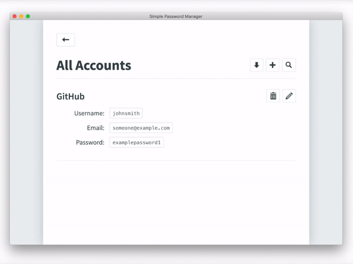

<h1 align="center">Welcome to JSON Password Manager 👋</h1>
<p>
  <a href="https://github.com/xtrp/JSON-Password-Manager#readme" target="_blank">
    
  </a>
  <a href="https://github.com/xtrp/JSON-Password-Manager/graphs/commit-activity" target="_blank">
    
  </a>
  <a href="#" target="_blank">
    
  </a>
</p>

The password manager built for developers, based on JSON.



Written in Electron with plain HTML, CSS, and JavaScript. No frameworks, no CSS preprocessor: nothing. Which means anyone, even beginners that only know plain HTML and CSS can contribute.

Uses AES and PBKDF2 for encryption and key derivation respectfully, and all passwords are stored locally.

### 🏠 [Homepage and Download](https://xtrp.github.io/JSON-Password-Manager/)

## Install

```sh
npm install
```

## Usage

```sh
npm run start
```

## Author

👤 **Fred Adams <xtrp@xtrp.io>**

* Website: http://xtrp.io/
* Github: [@xtrp](https://github.com/xtrp)

## 🤝 Contributing

Contributions, issues and feature requests are welcome!<br />Feel free to check [issues page](https://github.com/xtrp/JSON-Password-Manager/issues).

## Show your support

Give a ⭐️ if you like this project!