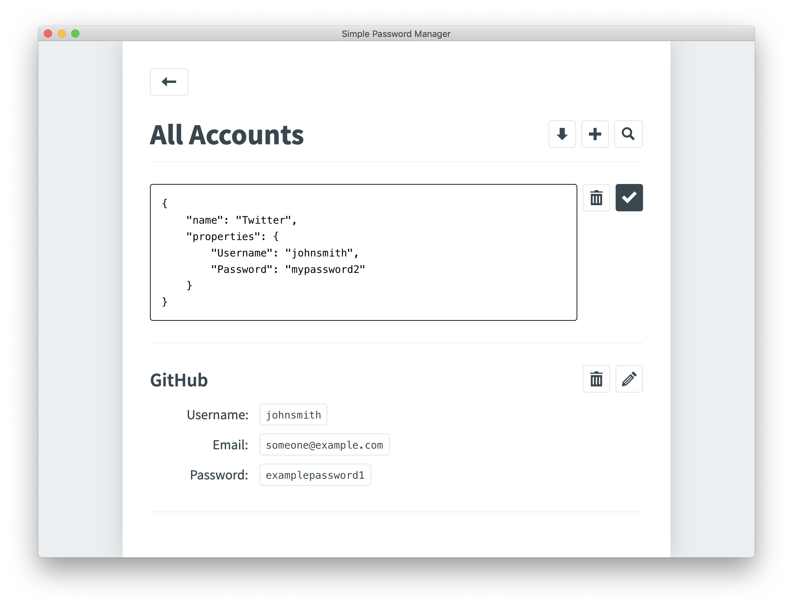

# 👋 Welcome to JSON Password Manager

<p>
  <a href="https://github.com/xtrp/JSON-Password-Manager#readme" target="_blank">
    
  </a>
  <a href="https://github.com/xtrp/JSON-Password-Manager/graphs/commit-activity" target="_blank">
    
  </a>
  <a href="#" target="_blank">
    
  </a>
</p>

The password manager built for developers, based on JSON.

<div align="center">



</div>

<!--## Download

Check out the download page at [🏠 Here](https://xtrp.github.io/JSON-Password-Manager/) to download the app!-->

## 🔥 Written in the Basic Languages of the Web

We use the most basic languages of the web: HTML, CSS, and JavaScript. All our code is written to be easy read, simple, and well commented, which means even beginners can contribute. We don't use any extra JS frameworks or CSS preprocessors. We only what we need, which makes JSON Password Manager not only lightweight, but also a really great project to contribute to because the codebase is so easy to understand.

 - Electron
 - Plain HTML, CSS, and JavaScript
 - **No frameworks, no CSS preprocessor: nothing.** Which means anyone, even beginners that only know plain HTML and CSS can contribute.

## 🔑 Using World-Class Encryption Tools

We use the modern encryption standards of today: AES 256 for encryption, and PBKDF2 for key derivation. All passwords are stored locally, removing the major possibility of remote attacks or server breaches, because there really is simply no server.

 - AES 256 bit
 - PBKDF2 for key derivation
 - All passwords are stored locally

## 🐼 Why? &mdash; Security, Customizability, and Versatility

There are already a lot of popular password managers out there, with cool features like autofill Chrome Extensions, mobile apps, and more. They have really nice UIs, and some even have extra features like a built-in VPN and encrypted file storage.

But what do we really want in a password manager? It's simple. We want **security, customizability, and versatility**. And that's what JSON Password Manager provides:

1. **Security:** We use NPM packages for encryption written and maintained by reputable third-parties, with PBKDF2 and AES 256 bit. We store all of your data locally with no communication whatsoever with an external server. With JSON Password Manager, it is almost impossible to get hacked remotely by someone without access to your physical machine. Still concerned about security? Well, you can see the code for yourself on our open-sourced [GitHub repo](https://github.com/xtrp/JSON-Password-Manager), and if you find an issue, submit it, and we will review and update the app promptly. Feature contributions are welcome too!
2. **Customizability:** Account information is based on JSON. If you can write it in JSON, you can put it on the JSON Password Manager. You can opt for basic single-level key-value pairs, or, you can nest multiple keys and values. JSON is simple yet provides superior customizability and configuration. You are free to write your account data however you like, and even use JSON Password Manager for encrypted text and notes instead of passwords.
3. **Versatility:** The AES-256 encrypted contents of the vault are stored in a single, secure text file. You can download this file, and transfer it to other devices with a click of a button. Since it's just a simple text file, it can be transferred by virtually any tool: email, Google Drive, Dropbox, iCloud, via external disks, and so much more. If you're switching to a new computer, all you have to do is download that file, and you can use it in your next install of JSON Password Manager as you wish. Note that once downloaded, it's your job to keep that encrypted file safe.

## 🤝 License and Guarantees

We are not security experts. JSON Password Manager is provided on an "as-is" basis and makes no warranties regarding the security of user data, and disclaims liability for damages resulting from using JSON Password Manager. If you are concerned about password security, it's always best to consult with a security professional. More information can be seen at LICENSE.txt.

## ✌️ Development

1. Clone the repo:

```sh
git clone https://github.com/xtrp/JSON-Password-Manager.git
```

2. Go to the project directory and install dependencies:

```sh
cd JSON-Password-Manager && npm install
```

3. Run ```npm start``` to start up the Electron app!

## ⚡️ Contributing

Contributions, issues and feature requests are welcome!<br />Feel free to check the [issues page](https://github.com/xtrp/JSON-Password-Manager/issues).

## 👍 Show your support

Give a ⭐️ if you like this project!
